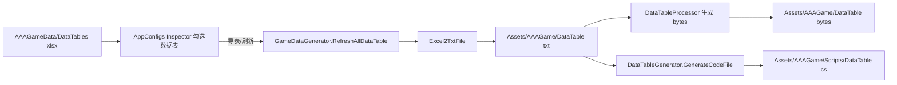
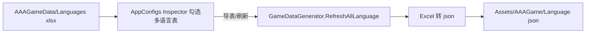
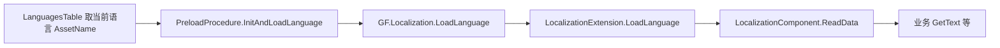

# AAAGameData Excel 使用说明

<!-- markdownlint-disable MD060 -->

AAAGameData 是 GF_X 项目的**游戏外部数据源根目录**，存放配置表、数据表、多语言表等 Excel 文件。编辑模式下通过导表工具将 Excel 导出为运行时可加载的文本/二进制与生成代码，写入 `Assets/AAAGame` 下对应目录；运行模式从这些生成物加载并供业务使用。下文按**配置表（Config）**、**数据表（DataTable）**、**多语言表（Language）** 三种流程分别介绍，每种含**编辑模式**与**运行模式**两张流程图及所涉编辑器、脚本与代码的关联。

---

## 二、配置表（Config）流程

### 2.1 编辑模式流程图

```mermaid
flowchart LR
    ExcelConfig[AAAGameData/Configs xlsx]
    Inspector[AppConfigs Inspector 勾选配置表]
    Refresh[GameDataGenerator.RefreshAllConfig]
    Excel2Txt[Excel2TxtFile]
    AssetsTxt[Assets/AAAGame/Config txt]
    ExportBytes[ExportConfig2BytesFile]
    AssetsBytes[Assets/AAAGame/Config bytes]
    ExcelConfig --> Inspector
    Inspector -->|"导表/刷新"| Refresh
    Refresh --> Excel2Txt
    Excel2Txt --> AssetsTxt
    AssetsTxt --> ExportBytes
    ExportBytes --> AssetsBytes
```



### 2.2 运行模式流程图


### 2.3 关联说明

- **编辑器**：[AppConfigsInspector](Assets/AAAGame/ScriptsBuiltin/Editor/AppConfigsInspector.cs) 展示配置表列表与导表按钮；[GameDataGenerator](Assets/AAAGame/ScriptsBuiltin/Editor/GameDataGenerator.cs) 的 `RefreshAllConfig`、`Excel2TxtFile`、`ExportConfig2BytesFile`；路径来自 [ConstEditor](Assets/AAAGame/ScriptsBuiltin/Editor/Common/ConstEditor.cs)（ConfigExcelPath → GameConfigPath）。
- **脚本**：[AppConfigs](Assets/AAAGame/Scripts/ScriptableObject/AppConfigs.cs) 存 Configs 列表与 LoadFromBytes；[ConfigExtension](Assets/AAAGame/Scripts/Extension/ConfigExtension.cs) 封装 LoadConfig（含 A/B 组）。
- **运行时代码**：[PreloadProcedure](Assets/AAAGame/Scripts/Procedures/PreloadProcedure.cs) 的 `LoadConfigsAndDataTables` 中按 AppConfigs 加载配置表；GF 框架的 ConfigComponent 负责解析 txt/bytes；业务通过 `GF.Config.GetString(key)` 等读取。

编辑模式产出的 `Assets/AAAGame/Config` 下 .txt/.bytes 即运行模式所加载的输入。

---

## 三、数据表（DataTable）流程

### 3.1 编辑模式流程图



### 3.2 运行模式流程图


### 3.3 关联说明

- **编辑器**：AppConfigsInspector（数据表列表与导表）；GameDataGenerator（RefreshAllDataTable、Excel2Txt、GenerateDataFile、以及调用 DataTableGenerator 生成代码）；[DataTableGenerator](Assets/AAAGame/ScriptsBuiltin/Editor/DataTableGenerator/DataTableGenerator.cs) 与 [DataTableProcessor](Assets/AAAGame/ScriptsBuiltin/Editor/DataTableGenerator/DataTableProcessor.cs)；ConstEditor 的 DataTableExcelPath、DataTablePath、DataTableCodePath。
- **脚本**：AppConfigs.DataTables；[DataTableExtension](Assets/AAAGame/Scripts/Extension/DataTableExtension.cs)（LoadDataTable、A/B 表名拼接）。
- **运行时代码**：PreloadProcedure.LoadConfigsAndDataTables 中加载数据表；DataTableComponent 读取 .txt/.bytes；生成的 DataTable 行类在 Hotfix 程序集中，供 `GetDataTable<T>()` 使用；PreloadProcedure 中还通过 **LanguagesTable** 取当前语言对应的多语言资源名。

编辑模式产出的 DataTable 的 .txt/.bytes 与 `Scripts/DataTable` 下 C# 代码即运行模式所加载的数据与类型来源。

### 3.4 数据表 Excel 行格式（必读）

本项目的 DataTable 导表工具**固定要求** Excel（或导出后的 .txt）至少包含 **5 行**，行下标由 [DataTableGenerator.CreateDataTableProcessor](Assets/AAAGame/ScriptsBuiltin/Editor/DataTableGenerator/DataTableGenerator.cs) 写死（nameRow=1, typeRow=2, commentRow=3, contentStartRow=4）。**行数不足会报错**：`GameFrameworkException: Comment row '3' >= raw row count '3' is not allow.`

| 行号（0-based） | 用途     | 说明 |
|-----------------|----------|------|
| **第 1 行（0）** | 标题行   | 第一列一般为 `#`，第二列可写表名或留空；整行可为注释。 |
| **第 2 行（1）** | 字段名   | 第一列 `#`，第二列起为各列字段名（如 Id、LevelMin）；字段名须以大写字母开头、仅含字母/数字/下划线。 |
| **第 3 行（2）** | 类型     | 第一列 `#`，第二列起为类型（int、string、bool、intArray 等）。 |
| **第 4 行（3）** | 注释行   | 第一列 `#`，第二列起为各列说明（可空或填中文备注）。 |
| **第 5 行起（4+）** | 数据行   | 第一列可为 `#` 或空，**第二列为主键 Id**（idColumn=1），其后为各列数据。 |

- **主键**：主键列索引为 1（第二列），通常命名为 `Id`，类型为 int。
- **首列**：第 0 列通常为 `#` 或空，用于注释/标题，导表时可能被忽略或作为注释标记。
- **参考**：可对照已导出的 `Assets/AAAGame/DataTable/LevelTable.txt`、`Core/UITable.txt` 的格式；新表需与之一致，否则导表失败。

---

## 四、多语言表（Language）流程

### 4.1 编辑模式流程图



### 4.2 运行模式流程图



### 4.3 关联说明

- **编辑器**：AppConfigsInspector（多语言表列表与导表）；GameDataGenerator.RefreshAllLanguage；ConstEditor.LanguageExcelPath、LanguagePath。
- **脚本**：AppConfigs.Languages；[LocalizationExtension](Assets/AAAGame/Scripts/Extension/LocalizationExtension.cs)（LoadLanguage、A/B）；LanguagesTable 为数据表，存各语言 key 与 AssetName 的对应。
- **运行时代码**：PreloadProcedure.InitAndLoadLanguage；LocalizationComponent；SettingDialog 等切换语言时也会调用 LoadLanguage。多语言 Excel 与 **Tools/LocalizationStringScanner** 配合：可从代码中扫描需翻译的 key，整理进多语言表；详见 [项目目录结构](项目目录结构.md) 中「三、Tools」及 README。

编辑模式产出的 `Assets/AAAGame/Language` 下 .json 即运行模式所加载的输入。

---

## 五、A/B Test 与 Excel 约定

- **A/B Test 表**：命名规则为 `[主表文件名]#[测试组名].xlsx`（如 `GameConfig#GroupA.xlsx`），代码中通过 `#`（`ConstBuiltin.AB_TEST_TAG`）识别；导表时主表与 AB 表一并导出，运行时通过 `GF.Setting.SetABTestGroup("GroupName")` 分配测试组后加载对应表。
- **Excel 与 Sheet**：每个 Excel 使用**第一个 Sheet** 导表。**数据表**必须满足 **3.4 数据表 Excel 行格式**（至少 5 行：标题、字段名、类型、注释、数据），否则会报 `Comment row '3' >= raw row count`；配置表的列格式与类型由项目内导表工具定义，新表可参考现有 Excel 或导表错误提示调整。

---

## 六、附录：当前所有配置文件作用说明

以下列出当前仓库中 AAAGameData 下所有 .xlsx；作用说明根据目录命名与框架代码推断，具体以项目实际使用为准。

| 相对路径（AAAGameData 下）   | 类型     | 作用说明                           |
| ---------------------------- | -------- | ---------------------------------- |
| Configs/GameConfig.xlsx      | Config   | 游戏全局配置（键值对）             |
| DataTables/CameraViewTable.xlsx | DataTable | 镜头视图表                         |
| DataTables/ColorTable.xlsx   | DataTable | 颜色表                             |
| DataTables/CombatUnitTable.xlsx | DataTable | 战斗单位表                         |
| DataTables/Core/EntityGroupTable.xlsx | DataTable | 实体组配置（框架用）               |
| DataTables/Core/LanguagesTable.xlsx | DataTable | 语言资源名与 key 对应（框架用）    |
| DataTables/Core/SoundGroupTable.xlsx | DataTable | 音效组配置（框架用）               |
| DataTables/Core/UIGroupTable.xlsx | DataTable | UI 组配置（框架用）                |
| DataTables/Core/UITable.xlsx  | DataTable | UI 表单（框架用）                  |
| DataTables/LevelTable.xlsx   | DataTable | 关卡表                             |
| DataTables/TestTable.xlsx    | DataTable | 测试表                             |
| Languages/ChineseSimplified.xlsx | Language | 简体中文多语言文本                 |
| Languages/ChineseTraditional.xlsx | Language | 繁体中文多语言文本                 |
| Languages/English.xlsx       | Language | 英文多语言文本                     |
| Languages/Japanese.xlsx      | Language | 日文多语言文本                     |
| Languages/Korean.xlsx        | Language | 韩文多语言文本                     |

---

## 附录2：各流程运行时调用示例代码

以下示例展示配置表、数据表、多语言表在运行时的加载与读取方式（需在配置表/数据表/多语言表已通过 PreloadProcedure 等流程加载完成后使用）。`GF` 为框架入口，具体 API 以当前工程为准。

### 配置表（Config）运行时示例

```csharp
// 加载配置表（通常在 PreloadProcedure 中按 AppConfigs.Configs 统一加载）
var appConfig = await AppConfigs.GetInstanceSync();
GF.Config.LoadConfig("GameConfig", appConfig.LoadFromBytes, this);

// 读取配置项（加载完成事件回调后使用）
string value = GF.Config.GetString("SomeKey");
int intVal = GF.Config.GetInt("IntKey");
float floatVal = GF.Config.GetFloat("FloatKey");
bool boolVal = GF.Config.GetBool("BoolKey");
Vector2 vec2 = GF.Config.GetVector2("Vec2Key");
Vector3 vec3 = GF.Config.GetVector3("Vec3Key");
// 判断是否存在
if (GF.Config.HasConfig("Key")) { ... }
```

### 数据表（DataTable）运行时示例

```csharp
// 加载数据表（通常在 PreloadProcedure 中按 AppConfigs.DataTables 统一加载）
var appConfig = await AppConfigs.GetInstanceSync();
GF.DataTable.LoadDataTable("LevelTable", appConfig.LoadFromBytes, this);

// 加载完成后获取表并读取行（表名为导表生成的 C# 行类型名，如 LevelTable、LanguagesTable）
var levelTb = GF.DataTable.GetDataTable<LevelTable>();
var row = levelTb.GetDataRow(1);                    // 按 ID 取一行
var rowByCond = levelTb.GetDataRow(r => r.LevelId == 5);
var minRow = levelTb.MinIdDataRow;
levelTb.GetAllDataRows(list);                       // 填入所有行
// 使用行字段
int id = row.Id;
string name = row.LevelName;
```

### 多语言表（Language）运行时示例

```csharp
// 加载多语言表（通常在 PreloadProcedure.InitAndLoadLanguage 中根据当前语言加载）
// 先通过 LanguagesTable 取得当前语言对应的资源名，再加载
var langTb = GF.DataTable.GetDataTable<LanguagesTable>();
var langRow = langTb.GetDataRow(r => r.LanguageKey == GF.Localization.Language.ToString());
GF.Localization.LoadLanguage(langRow.AssetName, appConfig.LoadFromBytes, this);

// 或使用异步重载（内部会取 AppConfigs.LoadFromBytes）
GF.Localization.LoadLanguage(GF.Localization.Language.ToString(), this);

// 读取多语言文本（加载完成后使用）
string text = GF.Localization.GetString("Key");     // 与多语言 Excel 中 key 对应
```

---

## 附录3：运行时资源加载目录与项目代码目录

本附录说明与 AAAGameData 导表流程相关的**运行时资源加载目录**（导表产出物所在位置，供运行时加载）以及**项目代码目录**（脚本与程序集所在位置）。更完整的目录层级与说明见 [项目目录结构](项目目录结构.md) 中「四、Assets」一节。

### 运行时资源加载目录

以下目录位于 `Assets/AAAGame` 下，由 AAAGameData 导表工具写入，运行时通过 GF 的 ConfigComponent、DataTableComponent、LocalizationComponent 按资源路径加载（路径由 `UtilityBuiltin.AssetsPath.GetConfigPath` / `GetDataTablePath` / `GetLanguagePath` 等拼装）。

| 路径（相对 Assets）       | 说明                                                                 |
| ------------------------- | -------------------------------------------------------------------- |
| `AAAGame/Config`          | 配置表导表产出：.txt、.bytes。运行时按配置表名（如 GameConfig）加载。   |
| `AAAGame/DataTable`       | 数据表导表产出：.txt、.bytes，可含子目录（如 Core）。运行时按表名加载。 |
| `AAAGame/Language`        | 多语言表导表产出：.json。运行时按语言资源名（如 English）加载。         |

上述路径与编辑器中的 `ConstEditor.GameConfigPath`、`DataTablePath`、`LanguagePath` 一致；资源通常随 AssetBundle 或 Resources 打包，运行时通过 GF.Resource 加载。

### 项目代码目录

与配置表/数据表/多语言表**加载与使用**相关的代码分布在以下目录（均相对 `Assets/AAAGame`）：

| 路径                         | 说明                                                                 |
| ---------------------------- | -------------------------------------------------------------------- |
| `Scripts/DataTable`          | 数据表导表生成的 C# 行类型与表结构代码（如 LevelTable.cs），热更程序集引用。 |
| `Scripts/Extension`          | 运行时扩展方法：ConfigExtension、DataTableExtension、LocalizationExtension 等，封装 LoadConfig、LoadDataTable、LoadLanguage 及 A/B 表逻辑。 |
| `Scripts/Procedures`         | 流程脚本：PreloadProcedure 中按 AppConfigs 加载配置表/数据表/多语言表。   |
| `Scripts/ScriptableObject`   | AppConfigs 等 ScriptableObject，定义 Configs/DataTables/Languages 列表及 LoadFromBytes。 |
| `ScriptsBuiltin/Runtime`     | 内置运行时（不可热更）：ConstBuiltin、路径与工具类等。                   |
| `ScriptsBuiltin/Editor`      | 内置编辑器（仅编辑期）：GameDataGenerator、DataTableGenerator、AppConfigsInspector、ConstEditor，负责导表与 Inspector 配置。 |

热更业务脚本（UI、Entity、Demo 等）位于 `Scripts` 下其他子目录，通过 `GF.Config`、`GF.DataTable`、`GF.Localization` 访问已加载的配置与数据；完整目录列表与说明见 [项目目录结构](项目目录结构.md) 的「4.3 三级（AAAGame 下）」表格。

---

本文档与 [项目目录结构](项目目录结构.md) 配套使用；路径与行为以当前代码为准（ConstEditor、GameDataGenerator、PreloadProcedure、各 Extension），若后续工具或路径变更请同步更新本文档。
