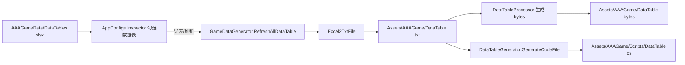

# AAAGameData Excel 使用说明

<!-- markdownlint-disable MD060 -->

AAAGameData 是 GF_X 项目的**游戏外部数据源根目录**，存放配置表、数据表、多语言表等 Excel 文件。编辑模式下通过导表工具将 Excel 导出为运行时可加载的文本/二进制与生成代码，写入 `Assets/AAAGame` 下对应目录；运行模式从这些生成物加载并供业务使用。下文按**配置表（Config）**、**数据表（DataTable）**、**多语言表（Language）** 三种流程分别介绍，每种含**编辑模式**与**运行模式**两张流程图及所涉编辑器、脚本与代码的关联。

---

## 二、配置表（Config）流程

### 2.1 编辑模式流程图

```mermaid
flowchart LR
    ExcelConfig[AAAGameData/Configs xlsx]
    Inspector[AppConfigs Inspector 勾选配置表]
    Refresh[GameDataGenerator.RefreshAllConfig]
    Excel2Txt[Excel2TxtFile]
    AssetsTxt[Assets/AAAGame/Config txt]
    ExportBytes[ExportConfig2BytesFile]
    AssetsBytes[Assets/AAAGame/Config bytes]
    ExcelConfig --> Inspector
    Inspector -->|"导表/刷新"| Refresh
    Refresh --> Excel2Txt
    Excel2Txt --> AssetsTxt
    AssetsTxt --> ExportBytes
    ExportBytes --> AssetsBytes
```

### 2.2 运行模式流程图

### 2.3 关联说明

- **编辑器**：[AppConfigsInspector](Assets/AAAGame/ScriptsBuiltin/Editor/AppConfigsInspector.cs) 展示配置表列表与导表按钮；[GameDataGenerator](Assets/AAAGame/ScriptsBuiltin/Editor/GameDataGenerator.cs) 的 `RefreshAllConfig`、`Excel2TxtFile`、`ExportConfig2BytesFile`；路径来自 [ConstEditor](Assets/AAAGame/ScriptsBuiltin/Editor/Common/ConstEditor.cs)（ConfigExcelPath → GameConfigPath）。
- **脚本**：[AppConfigs](Assets/AAAGame/Scripts/ScriptableObject/AppConfigs.cs) 存 Configs 列表与 LoadFromBytes；[ConfigExtension](Assets/AAAGame/Scripts/Extension/ConfigExtension.cs) 封装 LoadConfig（含 A/B 组）。
- **运行时代码**：[PreloadProcedure](Assets/AAAGame/Scripts/Procedures/PreloadProcedure.cs) 的 `LoadConfigsAndDataTables` 中按 AppConfigs 加载配置表；GF 框架的 ConfigComponent 负责解析 txt/bytes；业务通过 `GF.Config.GetString(key)` 等读取。

编辑模式产出的 `Assets/AAAGame/Config` 下 .txt/.bytes 即运行模式所加载的输入。

---

## 三、数据表（DataTable）流程

### 3.1 编辑模式流程图

### 3.2 运行模式流程图

### 3.3 关联说明

- **编辑器**：AppConfigsInspector（数据表列表与导表）；GameDataGenerator（RefreshAllDataTable、Excel2Txt、GenerateDataFile、以及调用 DataTableGenerator 生成代码）；[DataTableGenerator](Assets/AAAGame/ScriptsBuiltin/Editor/DataTableGenerator/DataTableGenerator.cs) 与 [DataTableProcessor](Assets/AAAGame/ScriptsBuiltin/Editor/DataTableGenerator/DataTableProcessor.cs)；ConstEditor 的 DataTableExcelPath、DataTablePath、DataTableCodePath。
- **脚本**：AppConfigs.DataTables；[DataTableExtension](Assets/AAAGame/Scripts/Extension/DataTableExtension.cs)（LoadDataTable、A/B 表名拼接）。
- **运行时代码**：PreloadProcedure.LoadConfigsAndDataTables 中加载数据表；DataTableComponent 读取 .txt/.bytes；生成的 DataTable 行类在 Hotfix 程序集中，供 `GetDataTable<T>()` 使用；PreloadProcedure 中还通过 **LanguagesTable** 取当前语言对应的多语言资源名。

编辑模式产出的 DataTable 的 .txt/.bytes 与 `Scripts/DataTable` 下 C# 代码即运行模式所加载的数据与类型来源。

---

## 四、多语言表（Language）流程

### 4.1 编辑模式流程图

### 4.2 运行模式流程图

### 4.3 关联说明

- **编辑器**：AppConfigsInspector（多语言表列表与导表）；GameDataGenerator.RefreshAllLanguage；ConstEditor.LanguageExcelPath、LanguagePath。
- **脚本**：AppConfigs.Languages；[LocalizationExtension](Assets/AAAGame/Scripts/Extension/LocalizationExtension.cs)（LoadLanguage、A/B）；LanguagesTable 为数据表，存各语言 key 与 AssetName 的对应。
- **运行时代码**：PreloadProcedure.InitAndLoadLanguage；LocalizationComponent；SettingDialog 等切换语言时也会调用 LoadLanguage。多语言 Excel 与 **Tools/LocalizationStringScanner** 配合：可从代码中扫描需翻译的 key，整理进多语言表；详见 [项目目录结构](项目目录结构.md) 中「三、Tools」及 README。

编辑模式产出的 `Assets/AAAGame/Language` 下 .json 即运行模式所加载的输入。

---

## 五、A/B Test 与 Excel 约定

- **A/B Test 表**：命名规则为 `[主表文件名]#[测试组名].xlsx`（如 `GameConfig#GroupA.xlsx`），代码中通过 `#`（`ConstBuiltin.AB_TEST_TAG`）识别；导表时主表与 AB 表一并导出，运行时通过 `GF.Setting.SetABTestGroup("GroupName")` 分配测试组后加载对应表。
- **Excel 与 Sheet**：每个 Excel 使用**第一个 Sheet** 导表；数据表/配置表的列格式与类型由 GF DataTable/Config 及项目内 DataTableGenerator 等定义，新表可参考现有 Excel 或导表错误提示调整。

---

## 六、附录：当前所有配置文件作用说明

以下列出当前仓库中 AAAGameData 下所有 .xlsx；作用说明根据目录命名与框架代码推断，具体以项目实际使用为准。

| 相对路径（AAAGameData 下）   | 类型     | 作用说明                           |
| ---------------------------- | -------- | ---------------------------------- |
| Configs/GameConfig.xlsx      | Config   | 游戏全局配置（键值对）             |
| DataTables/CameraViewTable.xlsx | DataTable | 镜头视图表                         |
| DataTables/ColorTable.xlsx   | DataTable | 颜色表                             |
| DataTables/CombatUnitTable.xlsx | DataTable | 战斗单位表                         |
| DataTables/Core/EntityGroupTable.xlsx | DataTable | 实体组配置（框架用）               |
| DataTables/Core/LanguagesTable.xlsx | DataTable | 语言资源名与 key 对应（框架用）    |
| DataTables/Core/SoundGroupTable.xlsx | DataTable | 音效组配置（框架用）               |
| DataTables/Core/UIGroupTable.xlsx | DataTable | UI 组配置（框架用）                |
| DataTables/Core/UITable.xlsx  | DataTable | UI 表单（框架用）                  |
| DataTables/LevelTable.xlsx   | DataTable | 关卡表                             |
| DataTables/TestTable.xlsx    | DataTable | 测试表                             |
| Languages/ChineseSimplified.xlsx | Language | 简体中文多语言文本                 |
| Languages/ChineseTraditional.xlsx | Language | 繁体中文多语言文本                 |
| Languages/English.xlsx       | Language | 英文多语言文本                     |
| Languages/Japanese.xlsx      | Language | 日文多语言文本                     |
| Languages/Korean.xlsx        | Language | 韩文多语言文本                     |

---

本文档与 [项目目录结构](项目目录结构.md) 配套使用；路径与行为以当前代码为准（ConstEditor、GameDataGenerator、PreloadProcedure、各 Extension），若后续工具或路径变更请同步更新本文档。
