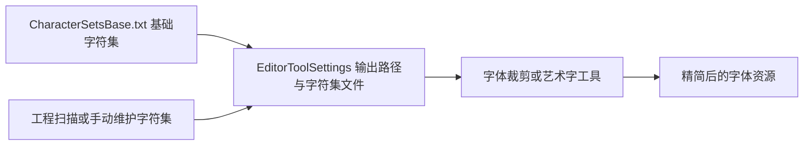

# FontMinify 字体精简

<!-- markdownlint-disable MD060 -->

对应目录：**Tools/FontMinify**。用于配置与输出字体裁剪用的字符集文件，配合编辑器中的字体裁剪、艺术字等工具，减小字体资源体积。

---

## 使用方式

1. **配置**：在 **ProjectSettings/EditorToolSettings** 中设置：
   - **FontCroppingCharSetsOutput**：字符集输出目录，默认 `Tools\FontMinify`。
   - **FontCroppingCharSetsFile**：基础字符集文件路径，默认 `Tools\FontMinify\CharacterSetsBase.txt`。

2. **字符集文件**：
   - **CharacterSetsBase.txt**：基础字符集合（如常用 ASCII、标点），作为裁剪或艺术字的默认字符来源。
   - **CharSets_ScanFromProject.txt**：可从工程中扫描得到的字符集（如从场景、预制体、多语言表中收集到的用字），扫描结果可输出到此路径或同目录下文件，供字体裁剪时包含所需字形。

3. **使用场景**：编辑器内「批处理工具集」中的艺术字工具等会引用 **Tools/FontMinify/CustomFontChars.txt**（或配置的字符集路径）；字体裁剪功能根据上述输出目录与字符集文件生成只包含指定字符的字体资源，减小包体。

---

## 运行流程图

---

## 输入

| 输入项 | 说明 | 必填/默认 |
|--------|------|-----------|
| FontCroppingCharSetsFile | 基础字符集文件路径 | 默认 `Tools\FontMinify\CharacterSetsBase.txt` |
| FontCroppingCharSetsOutput | 字符集/输出目录 | 默认 `Tools\FontMinify` |
| 工程内用字 | 从场景、Prefab、多语言表等扫描得到的字符，可写入 CharSets_ScanFromProject.txt 或同目录 | 可选 |

---

## 产出内容的来源与后续使用

- **来源**：CharacterSetsBase.txt、CharSets_ScanFromProject.txt 等为人工维护或由扫描工具生成，存放在 Tools/FontMinify；字体裁剪/艺术字工具根据这些字符集与 EditorToolSettings 配置，生成只包含指定字符的字体资源（或艺术字图集）。
- **后续使用**：裁剪后的字体放入 Assets 中对应字体资源位置，运行时 UI 使用该字体时只加载已保留的字形，包体更小。
- **举例**：将多语言表中用到的汉字与 CharacterSetsBase.txt 合并，输出到 FontMinify 目录；在艺术字工具中选择「字符集文件」为 Tools/FontMinify/CustomFontChars.txt，生成仅含这些字的艺术字贴图，用于 UI 标题等，避免整字库带来的体积与性能开销。

---

更多目录说明见 [项目目录结构](../项目目录结构.md)。
