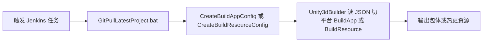
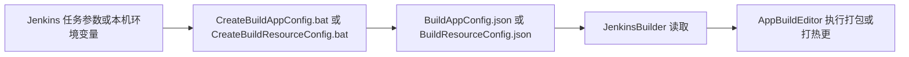
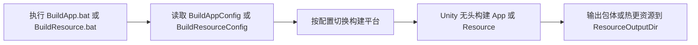

# Jenkins 自动化构建

<!-- markdownlint-disable MD060 -->

对应目录：**Tools/Jenkins**。提供 Jenkins 或本机命令行下的自动化构建：打 App 包（Build App）与打热更资源（Build Resource），通过 JSON 配置驱动 Unity 无头构建。

---

## 使用方式

1. **入口**：
   - **本机**：直接执行 **BuildApp.bat** 或 **BuildResource.bat** 可触发 Unity 构建（运行前需已存在并填好对应的 BuildAppConfig.json / BuildResourceConfig.json）。内部通过 Unity 的 `-executeMethod` 调用 `UGF.EditorTools.JenkinsBuilder.BuildApp` / `BuildResource`。本机也可先运行 **CreateBuildAppConfig.bat** / **CreateBuildResourceConfig.bat** 生成 JSON（需在命令行或环境中设置好对应变量），再运行 BuildApp/BuildResource.bat。
   - **Run_Jenkins.bat**：用于**启动 Jenkins 服务**（内容为 `java -jar jenkins.war`，需已安装 Java 且同目录或 PATH 下存在 jenkins.war）。拉代码与执行构建由 **Jenkins 任务**完成，任务定义见 **Tools/Jenkins/jobs/** 下的 config.xml。
   - **CreateBuildAppConfig.bat / CreateBuildResourceConfig.bat**：生成或更新 BuildAppConfig.json、BuildResourceConfig.json；在 Jenkins 任务中由第二步构建步骤调用，将任务参数写入上述 JSON。

2. **配置文件**：
   - **BuildAppConfig.json**：打 App 用。字段示例：ResourceOutputDir、Platform（如 StandaloneWindows64/Android）、FullBuild、DebugMode、DevelopmentBuild、BuildAppBundle、Version、VersionCode 等。
   - **BuildResourceConfig.json**：打热更资源用。字段示例：ResourceOutputDir、Platform、ForceRebuild、ResourceVersion、UpdatePrefixUrl、ApplicableVersions、ForceUpdate、AppUpdateUrl、AppUpdateDescription 等。
   - 路径为项目根下的 **Tools/Jenkins/BuildAppConfig.json**、**Tools/Jenkins/BuildResourceConfig.json**，由 [JenkinsBuilder](Assets/AAAGame/ScriptsBuiltin/Editor/JenkinsBuilder.cs) 读取。

3. **流程简述**：**本机**：运行 .bat → Unity 无头模式启动 → 读取 JSON → 切换平台（若需）→ AppBuildEditor 执行 JenkinsBuildApp/JenkinsBuildResource → 输出到 ResourceOutputDir。**Jenkins**：触发任务后按任务内三步顺序执行（见下节），最后同样由 Unity 读 JSON 并输出。

---

## Jenkins 部署

在机器上从零跑通 Jenkins 的要点如下：

- **运行 Jenkins**：可执行 **Tools/Jenkins/Run_Jenkins.bat**（需已安装 Java，且同目录或 PATH 下存在 jenkins.war），或使用系统/包管理器安装的 Jenkins。
- **插件**：任务使用 **Unity3d Builder** 插件（见 [jobs/Build App/config.xml](../../Tools/Jenkins/jobs/Build%20App/config.xml) 中的 `org.jenkinsci.plugins.unity3d.Unity3dBuilder`），需在 Jenkins 中安装该插件。
- **Unity 配置**：在 Jenkins 全局工具中配置 Unity 安装，名称与 config.xml 中的 `unity3dName` 一致（如 `Unity2022`），以便 Unity3dBuilder 能调用 Unity 可执行文件。
- **任务定义**：项目内已提供任务配置模板 **Tools/Jenkins/jobs/Build App/config.xml**、**Tools/Jenkins/jobs/Build Resource/config.xml**。在 Jenkins 中新建任务后，可将对应 config.xml 内容粘贴到任务配置中，或通过 Jenkins 的「从配置文件恢复」等方式导入，从而得到「Build App」「Build Resource」两个任务及其参数与构建步骤。

---

## Jenkins 任务内脚本调用顺序

Jenkins 任务（由 config.xml 定义）的构建步骤按以下**三步顺序**执行：

1. **GitPullLatestProject.bat**：根据 Jenkins 参数 `ProjectRoot`、`BranchName` 执行 `git reset --hard`、`checkout`、`pull`，拉取最新代码。
2. **CreateBuildAppConfig.bat** 或 **CreateBuildResourceConfig.bat**：根据当前任务的 Jenkins 参数（如 ProjectRoot、ResourceOutputDir、Platform、Version、VersionCode 等）**写入**项目根下 **Tools/Jenkins/BuildAppConfig.json** 或 **BuildResourceConfig.json**（参见 [CreateBuildAppConfig.bat](../../Tools/Jenkins/CreateBuildAppConfig.bat) / [CreateBuildResourceConfig.bat](../../Tools/Jenkins/CreateBuildResourceConfig.bat) 的 echo 内容）。
3. **Unity3dBuilder**：调用 Unity 无头模式，执行 `UGF.EditorTools.JenkinsBuilder.BuildApp` 或 `BuildResource`；[JenkinsBuilder.cs](Assets/AAAGame/ScriptsBuiltin/Editor/JenkinsBuilder.cs) 从上述 JSON 路径读取配置并切换平台、调用 AppBuildEditor 执行打包或打热更资源。

**参数与 JSON 的关系**：Jenkins 任务参数（如 ResourceOutputDir、Platform、Version、VersionCode 等）在构建时作为环境变量传入；Create*Config.bat 将这些变量拼成 JSON 并写入固定路径；紧接着的 Unity 步骤读取同一路径的 JSON。因此「Jenkins 参数」与「JSON 配置」是同一套配置的两种来源（本机直接编辑 JSON，Jenkins 通过参数生成 JSON）。

---

## 运行流程图

**本机构建流程**（直接运行 .bat，JSON 已就绪）：

---

## 输入

| 输入项 | 说明 | 必填/默认 |
|--------|------|-----------|
| BuildAppConfig.json | 打 App 配置，位于 Tools/Jenkins/ | 必填，BuildApp 时 |
| BuildResourceConfig.json | 打热更资源配置，位于 Tools/Jenkins/ | 必填，BuildResource 时 |
| ResourceOutputDir | 构建输出目录（如 AB 包、安装包所在路径） | 在对应 JSON 中配置 |
| Platform | 目标平台，如 StandaloneWindows64、Android | 在对应 JSON 中配置 |

**Jenkins 任务**：通过 **jobs/ 下 config.xml** 定义的参数（ProjectRoot、BranchName、Platform、ResourceOutputDir、Version、VersionCode、ForceRebuild、UpdatePrefixUrl 等）在构建时传入；本机使用时则直接编辑 JSON 或通过环境变量 + Create*Config.bat 生成 JSON。

---

## 产出内容的来源与后续使用

- **来源**：由 Unity 构建流程在 Jenkins/本机触发后生成；输出路径由 JSON 中的 ResourceOutputDir 等字段决定，通常指向项目下的 **AB** 或指定发布目录。
- **后续使用**：
  - **Build App**：产出安装包或可执行程序，用于发布、测试或上传商店；Version/VersionCode 等用于版本标识。
  - **Build Resource**：产出热更资源（如 AB），上传到 UpdatePrefixUrl 指向的 CDN 或服务器；客户端根据 ApplicableVersions、ResourceVersion 检测并下载热更。
- **举例**：Jenkins 任务执行 BuildResource.bat，BuildResourceConfig.json 中 ResourceOutputDir 为 `D:/GF_X/AB`，UpdatePrefixUrl 为 `https://xxx/hotfix/`；构建完成后将 AB 目录上传至该 URL，玩家启动游戏后根据当前版本与 ResourceVersion 拉取热更资源，实现无包更新。

---

更多目录说明见 [项目目录结构](../项目目录结构.md)。
