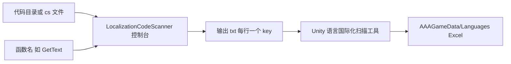

# LocalizationStringScanner 多语言字符串扫描

<!-- markdownlint-disable MD060 -->

对应目录：**Tools/LocalizationStringScanner**。控制台程序，从代码中扫描指定函数（如 `GF.Localization.GetText`）的字符串参数，输出 key 列表到文本文件，供 Unity 内「资源/语言国际化扫描工具」合并进多语言 Excel，实现多语言 key 的收集与补全。

---

## 使用方式

1. **控制台用法**（跨平台）：  
   需要 3 个参数，依次为：  
   - 要扫描的代码目录或单个 .cs 文件路径  
   - 要扫描的函数名（如 `GF.Localization.GetText`）  
   - 扫描结果输出文件路径（字符串列表，每行一个 key）  

   **示例**（参见项目内 [扫描代码中国际化语言工具.txt](../../Tools/LocalizationStringScanner/扫描代码中国际化语言工具.txt)）：
   ```text
   .\LocalizationCodeScanner D:\Workspace\GF_X\Assets\AAAGame\Scripts GF.Localization.GetText D:\Workspace\GF_X\Tools\LocalizationStrings.txt
   ```
   **注意**：结果为**追加**到输出文件，每次扫描前建议删除或清空输出文件，避免重复累积。

2. **与 Unity 工具配合**：  
   Unity 菜单 **「资源/语言国际化扫描工具」** 可从数据表、资源、代码等多处扫描多语言文本，并支持将结果保存到多语言 Excel。可将 LocalizationCodeScanner 生成的 txt 中的 key 整理后，通过该工具的「保存多语言」等操作合并进 **AAAGameData/Languages/** 下各语种 Excel，或作为新增 key 的参考来源。

---

## 运行流程图



---

## 输入

| 输入项 | 说明 | 必填/默认 |
|--------|------|-----------|
| 参数 1 | 要扫描的代码目录或 .cs 文件路径 | 必填 |
| 参数 2 | 要扫描的函数名，如 `GF.Localization.GetText` | 必填 |
| 参数 3 | 扫描结果输出文件路径（如 Tools/LocalizationStrings.txt） | 必填 |

---

## 产出内容的来源与后续使用

- **来源**：由 LocalizationCodeScanner 根据参数 1、2 扫描代码，将匹配到的字符串字面量（多语言 key）按行写入参数 3 指定的文件。
- **后续使用**：  
  - 将输出 txt 中的 key 与现有多语言表对比，缺失的 key 补充到 **AAAGameData/Languages/*.xlsx** 各语种表中，并填写翻译。  
  - 在 Unity 中对多语言表执行导表后，生成 **Assets/AAAGame/Language/*.json**；运行时通过 `GF.Localization.GetString(key)` 读取。  
- **举例**：对 `Assets/AAAGame/Scripts` 执行 `GF.Localization.GetText` 扫描，输出到 `Tools/LocalizationStrings.txt`，得到 50 个 key；发现其中 10 个在 English.xlsx 中缺失，在 Excel 中补全这 10 行并翻译，保存后于 Unity 中导表；游戏中即可通过 `GF.Localization.GetString("NewKey")` 显示对应语种文案。

---

更多目录说明见 [项目目录结构](../项目目录结构.md)；多语言表导表与运行时用法见 [AAAGameData Excel 使用说明](../AAAGameData-Excel使用说明.md)。
