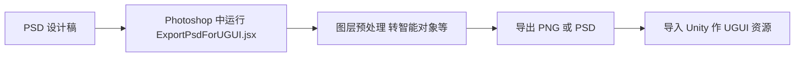

# PSD2UGUI PSD 转 UGUI

<!-- markdownlint-disable MD060 -->

对应目录：**Tools/PSD2UGUI**。提供在 Photoshop 中运行的脚本 **ExportPsdForUGUI.jsx**，用于将 PSD 图层预处理（如转智能对象、处理图层效果与文字层），便于导出后到 Unity 中作为 UGUI 使用的切图或分层资源。

---

## 使用方式

1. **放置脚本**：将 **ExportPsdForUGUI.jsx** 放在 **Tools/PSD2UGUI** 下（或 Photoshop 可识别的脚本目录）。
2. **在 Photoshop 中运行**：打开目标 PSD，在 Photoshop 中通过「文件 → 脚本 → 浏览」选择该 .jsx，或将其放入 Photoshop 的 Scripts 目录后通过「文件 → 脚本」菜单调用。脚本会遍历图层，对带图层效果或文字层执行转换（如转为智能对象等），以便后续导出为 UGUI 可用的资源。
3. **导出到 Unity**：在 Photoshop 中导出为 PNG 等格式，或使用 Unity 的 PSD 导入器/项目内 PSD2UGUI 相关功能（若已启用）将资源导入 **Assets**；在 Unity 中用于 UI 贴图、图集或 UGUI 绑定。

---

## 运行流程图

---

## 输入

| 输入项 | 说明 | 必填/默认 |
|--------|------|-----------|
| PSD 文件 | 在 Photoshop 中打开的 PSD，含图层、效果、文字等 | 必填 |
| ExportPsdForUGUI.jsx | 脚本路径，默认放在 Tools/PSD2UGUI/ | 必填 |

---

## 产出内容的来源与后续使用

- **来源**：脚本在 Photoshop 内对当前文档的图层进行预处理（不改变源 PSD 的保存路径时，产出为处理后的文档状态）；用户再通过 Photoshop 导出或 Unity 的 PSD 导入流程得到图片资源。
- **后续使用**：导出的贴图或分层图导入 Unity 后，放入 **Assets/AAAGame/Sprites/UI** 等目录，用于 UGUI Image、Sprite、图集；在 UI 预制体或界面中引用，实现与设计稿一致的界面表现。
- **举例**：设计在 PSD 中做好主界面背景、按钮、文字层并带图层效果；在 Photoshop 中运行 ExportPsdForUGUI.jsx 预处理后导出为多张 PNG，放入 Assets/AAAGame/Sprites/UI/MainMenu，在 Unity 中打成图集或直接引用，主菜单 UI 使用这些 Sprite 绑定到 UGUI 节点上显示。

---

更多目录说明见 [项目目录结构](../项目目录结构.md)。
