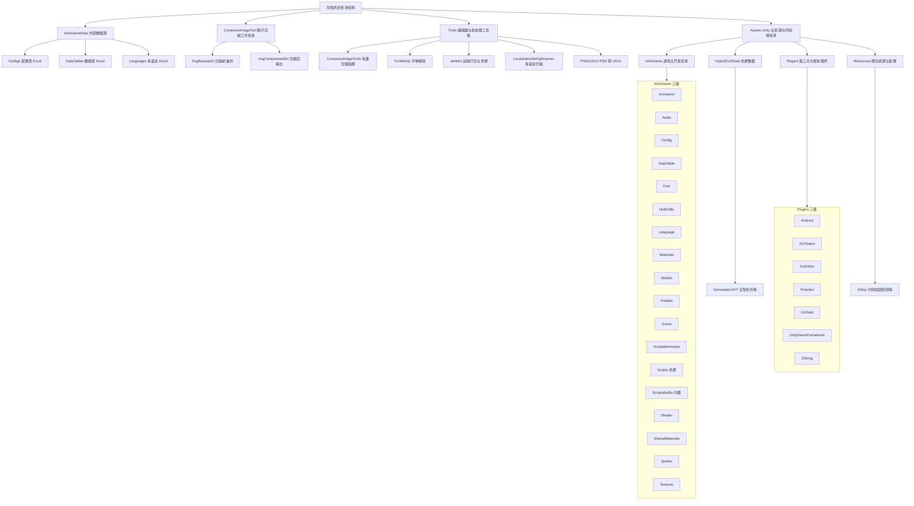

# GF_X 项目目录结构说明

<!-- markdownlint-disable MD060 -->

本文档说明 GF_X（GameFramework + HybridCLR 自动化游戏框架）项目中关键目录的层级与作用，便于查阅与新人上手。开发主目录为 `Assets/AAAGame`，启动场景为 `Assets/AAAGame/Scene/Launch`。

---

## 一、AAAGameData（1～2 级）

| 层级   | 路径                      | 作用                                                                                         |
| ------ | ------------------------- | -------------------------------------------------------------------------------------------- |
| 一级   | `AAAGameData`             | 游戏**外部数据源**根目录，存放 Excel 数据表、多语言表、配置表等，供导表工具与多语言工具读取并生成到工程内使用。 |
| 二级   | `AAAGameData/Configs`     | **配置表** Excel（如 GameConfig.xlsx），对应游戏配置数据。                                     |
| 二级   | `AAAGameData/DataTables`  | **数据表** Excel 及子目录（如 Core），导表后生成到 Assets/AAAGame/DataTable 等使用。           |
| 二级   | `AAAGameData/Languages`   | **多语言** Excel（简中、繁中、英、日、韩等），供多语言与扫描工具使用。                           |

---

## 二、CompressImageTool（1～2 级）

| 层级   | 路径                                  | 作用                                           |
| ------ | ------------------------------------- | ---------------------------------------------- |
| 一级   | `CompressImageTool`                   | **图片压缩工具**的工作目录，用于批量压缩贴图时的输入/输出与备份。 |
| 二级   | `CompressImageTool/ImgBackupDir`       | 压缩前的**图片备份**目录。                       |
| 二级   | `CompressImageTool/ImgCompressedDir`   | 压缩后的**图片输出**目录。                       |

---

## 三、Tools（1～2 级）

| 层级   | 路径                                | 作用                                                                                   |
| ------ | ----------------------------------- | -------------------------------------------------------------------------------------- |
| 一级   | `Tools`                             | **编辑器与批处理工具集**根目录，支撑打包、热更、多语言、UI、图片与字体优化等。                 |
| 二级   | `Tools/CompressImageTools`           | 图片压缩工具（如 pngquant 的 Win/Mac 版本），用于批量压缩贴图、减小包体。                   |
| 二级   | `Tools/FontMinify`                   | **字体精简**：字符集配置、从工程扫描字符集等，用于减小字体资源体积。                         |
| 二级   | `Tools/Jenkins`                     | **Jenkins 自动化构建**：Build App、Build Resource、热更脚本与配置（如 BuildApp.bat、BuildResource.bat、config 等）。 |
| 二级   | `Tools/LocalizationStringScanner`   | **多语言字符串扫描**：从代码中扫描需翻译的 key（如 GF.Localization.GetText），输出到多语言表。   |
| 二级   | `Tools/PSD2UGUI`                    | **PSD 转 UGUI**：将 PSD 设计稿导出为 Unity UGUI 的脚本与资源（如 ExportPsdForUGUI.jsx）。   |

---

## 四、Assets（1～3 级）

### 4.1 一级

| 层级   | 路径        | 作用                                                                   |
| ------ | ----------- | ---------------------------------------------------------------------- |
| 一级   | `Assets`    | Unity **主资源与代码根目录**，包含场景、预制体、脚本、插件、Resources、HybridCLR 数据等。 |

### 4.2 二级

| 路径                 | 作用                                                                                           |
| -------------------- | ---------------------------------------------------------------------------------------------- |
| `Assets/AAAGame`     | **游戏主开发目录**：场景、脚本（Scripts/ScriptsBuiltin）、预制体、UI/Entity、动画、音频、DataTable、多语言、材质、Shader 等。 |
| `Assets/HybridCLRData` | **HybridCLR 热更相关数据**（如 Generated），用于热更 DLL、AOT 补充等。                             |
| `Assets/Plugins`     | **第三方与框架插件**：UnityGameFramework、UniTask、ZString、DOTween、Protobuf、Android 等；ForEditor 下为仅编辑器用库。   |
| `Assets/Resources`   | 随包加载的资源与全局配置（如 AppSettings、DOTween 配置、Obfuz 密钥等）。                           |

### 4.3 三级（AAAGame 下）

| 路径                             | 作用                                                                               |
| -------------------------------- | ---------------------------------------------------------------------------------- |
| `Assets/AAAGame/Animation`       | 动画资源；子目录 UI 为界面动效。                                                     |
| `Assets/AAAGame/Audio`           | 音频资源。                                                                         |
| `Assets/AAAGame/Config`          | 配置相关资源。                                                                     |
| `Assets/AAAGame/DataTable`       | 导表生成的数据表资源；Core 为核心表。                                               |
| `Assets/AAAGame/Font`            | 字体；Common、TextMesh Pro 等子目录分类。                                            |
| `Assets/AAAGame/HotfixDlls`      | 热更 DLL 输出/引用。                                                                |
| `Assets/AAAGame/Language`       | 多语言资源。                                                                       |
| `Assets/AAAGame/Materials`       | 材质；Common 等子目录。                                                             |
| `Assets/AAAGame/Models`         | 模型资源。                                                                         |
| `Assets/AAAGame/Prefabs`         | 预制体；Core、Entity、UI 等子目录。                                                 |
| `Assets/AAAGame/Scene`           | 场景（含 Launch 启动场景）。                                                         |
| `Assets/AAAGame/ScriptableAssets` | ScriptableObject 资源；Core 等。                                                    |
| `Assets/AAAGame/Scripts`         | **热更脚本**：Common、DataModel、DataTable、Demo、Entity、EventArgs、Extension、Network、Procedures、ScriptableObject、UI 等。 |
| `Assets/AAAGame/ScriptsBuiltin`  | **内置程序集**：Editor（编辑器）、Runtime（运行时），不可热更。                       |
| `Assets/AAAGame/Shader`          | Shader；ASE 等子目录。                                                              |
| `Assets/AAAGame/SharedMaterials` | 共享材质。                                                                         |
| `Assets/AAAGame/Sprites`         | 精灵图；Common、UI 等子目录。                                                        |
| `Assets/AAAGame/Textures`        | 贴图资源。                                                                         |

### 4.4 三级（Plugins 下）

| 路径                              | 作用                                                       |
| --------------------------------- | ---------------------------------------------------------- |
| `Assets/Plugins/Android`          | Android 平台插件或原生库。                                   |
| `Assets/Plugins/DOTween`          | DOTween 动画插件；Editor、Modules 等子目录。                 |
| `Assets/Plugins/ForEditor`        | 仅编辑器用库（如 CompressImageLibs、EPPlus 等）。            |
| `Assets/Plugins/Protobuf`         | Protobuf 相关。                                            |
| `Assets/Plugins/UniTask`          | UniTask 异步库；Editor、Runtime。                           |
| `Assets/Plugins/UnityGameFramework` | GameFramework 本体；Configs、GameFramework、Libraries、Prefabs、Scripts。 |
| `Assets/Plugins/ZString`          | ZString 零分配字符串库；Number、Unity、Utf16、Utf8 等。      |

### 4.5 三级（HybridCLRData / Resources 下）

| 路径                           | 作用                                       |
| ------------------------------ | ------------------------------------------ |
| `Assets/HybridCLRData/Generated` | HybridCLR 自动生成代码（如 AOT 泛型补充等）。   |
| `Assets/Resources/Obfuz`        | Obfuz 代码加固相关资源（如密钥等）。           |

---

## 五、整个项目结构图

下图仅包含文档所述四类目录的**一、二、三级分支**及各自作用说明（AAAGameData / CompressImageTool / Tools 为 1～2 级，Assets 为 1～3 级）。Mermaid 图仅作结构示意。

---

本文档与 [README.md](../README.md) 配套使用，如有目录变更请随项目更新维护。
